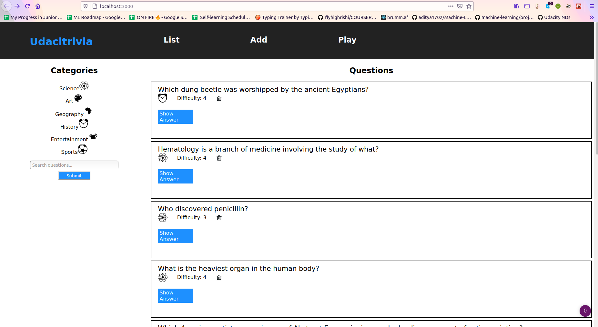
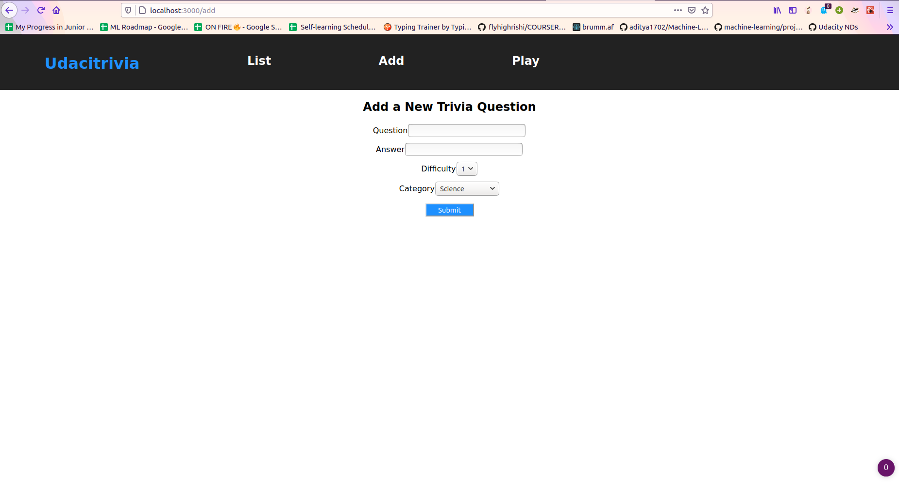
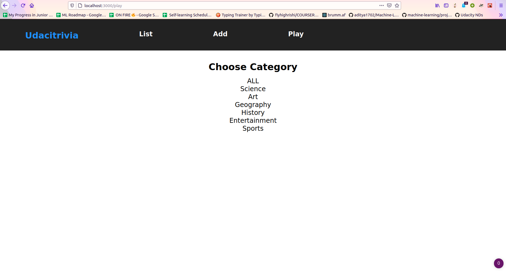
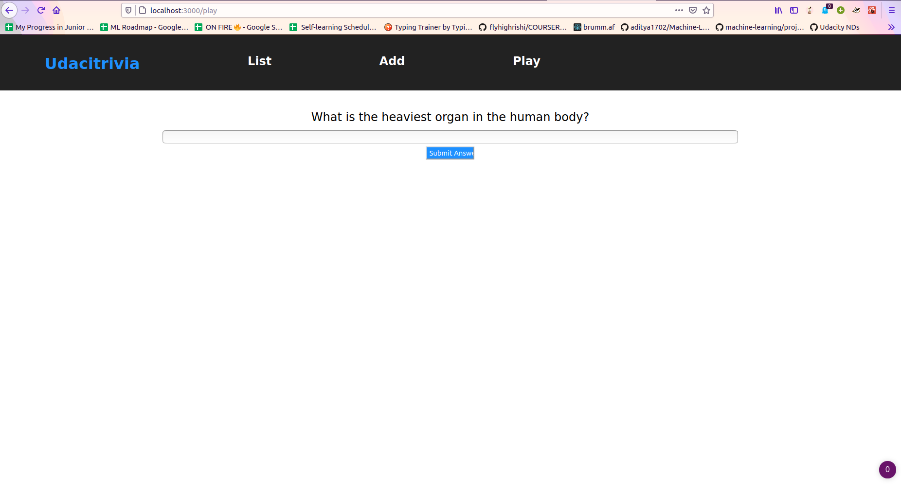
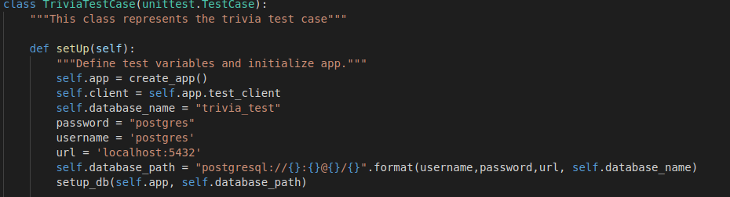

# Trivia API
This is the API for Udacity Trivia App, that is responsilbe for:
-  Display questions - both all questions and by category.
-  Delete questions.
-  Add questions.
-  Search for questions based on a text query string.
-  Play the quiz game, randomizing either all questions or within a specific category.

### Screenshots
**Questions page**


<br>
***
**Add new Question Form**


<br>
***
**Play Page Where you choose the category**


<br>
***
**Quiz Page**


***
# Getting Started
### Backend Dependencies
- Python 3.7, Install form [Here](https://realpython.com/installing-python/)
- Pip and Virtual env, Install by following the instructions [HERE](https://packaging.python.org/guides/installing-using-pip-and-virtual-environments/)
- Pip Dependencies, run `pip install -r requirements.txt` in your terminal
- Database Setup
    ```
    dropdb trivia
    createdb trivia
    psql trivia < trivia.psql
    ```
    open `models.py` and change the username and password to meet yours!
- Go to backend folder and open your terminal and run the following
    ```bash
    export FLASK_APP=flaskr
    flask run
    ```
### Frontend Dependencies
- Installing Node and NPM from [https://nodejs.com/en/download](https://nodejs.org/en/download/).
- Go to frontend directory and write `npm install` in your terminal.
- verify the installation by running `node -v` in your terminal.
- run `npm start` in your terminal
  
`NOTE: Make sure you have two terminals, one for the backend and the other for the frontend!`


# Testing
don't forget to open `test_flaskr.py` and change the **username** and **password** to meet yours!


To run the tests, run
```
dropdb trivia_test
createdb trivia_test
psql trivia_test < trivia.psql
python test_flaskr.py
```

# API Reference

## Getting Started
- Base URL: This app is locally hosted at `http://127.0.0.1:5000/` .
- Authentication: No authentication required.

## Error Handling

Errors are returned as JSON objects:
- Sample: curl http://127.0.0.1:5000/nonsense
  ```
  {
      "success": False,
      "error": 404,
      "message": "Not Found"
  }
  ```
  returned error codes:
  - 400: Bad Request
  - 404: Not Found
  - 500: Internal Server Error
  - 422: Unprocessable Entity

## Endpoints
### GET /questions
- **Genreal**:
  - Returns lists of question objects and categories, success value, and total number of questions
  - Results are paginated in groups of 10, include a request argument to choose page number, starting from 1 (Which is also a default value)
- **Sample**: `curl http://127.0.0.1:5000/questions`
  <br>
    ```
    {
        "success": True,
        "questions" : [
            {
                "question": "Who discovered pencillin?",
                "answer": "Alexander Fleming",
                "category": "Science",
                "difficulty": 3 
            },
            {
                "question": "La Giaconda is better known as what?",
                "answer": "Mona Lisa",
                "category": "Art",
                "difficulty": 3
            },  .....
        ],
        "categories": {
            "Science": 1,
            "Art": 2,
            "Geography": 3,
            "History": 4,
            "Entertainment": 5,
            "Sports": 6
        },
        "total_questions": 10
    }
    ```

### POST /questions
- **General**:
    - Creates a new question using the submitted question value, answer, difficulty, and category.
    - Reutrns success value, questions list paginated based on the page number, the inserted question, and total number of questions
- **Sample**: `curl http://127.0.0.1:5000/questions -X POST -H "Content-Type: application/json" -d '{"quesiton":"What is the name of the application?", "answer":"Trivia", "difficulty":1, "category":1}'`
<br>

```
  {
    "success": True,
    "questions" : [
            {
                "question": "What is the name of the application?",
                "answer": "Trivia",
                "category": 4
                "difficulty": 1
            },
            {
                "question": "Who discovered pencillin?",
                "answer": "Alexander Fleming",
                "category": 1,
                "difficulty": 3 
            },
            {
                "question": "La Giaconda is better known as what?",
                "answer": "Mona Lisa",
                "category": 2,
                "difficulty": 3
            },  .....
        ],
    "inserted_question": {
            "question": "What is the name of the application?",
            "answer": "Trivia",
            "category": 4
            "difficulty": 1
        },
    "total_questions": 11
  }
```
### DELETE /questions
- **General**:
    - Deleted the question with the gived ID if exists
    - Returns success value, the deleted question id, the number of tital questions, and questions list paginated based on the current page number.
- **Sample**: `curl -X DELETE http://127.0.0.1:5000/questions/5`
 <br>
```
{
    "success": True,
    "deleted": 5,
    "questions":[
            {
                "question": "Who discovered pencillin?",
                "answer": "Alexander Fleming",
                "category": 1,
                "difficulty": 3 
            },
            {
                "question": "La Giaconda is better known as what?",
                "answer": "Mona Lisa",
                "category": 2,
                "difficulty": 3
            },  .....
        ],
    "total_questions": 10
}
```

### POST /questions/search
- **Genreal**:
    -   search for questions that contain the given search term
    -   Returns success value, number of total questions,current category, and questions list that contains the given search term paginated baased on current page number.
- **Sample**: `curl http://127.0.0.1:5000/questions/search -X POST -H "Content-Type: application/json" -d '{"searchTerm":"title"}'`
<br>
```
{
    "success":True,
    "questions":[
        {
            "quesiton": "Whose autobigraphy is entitled 'I Know Why the Caged Bird Sings'?",
            "answer": "Maya Angelou",
            "category": "History",
            "difficulty": 2
        },
        {
            "quesiton": "What was the title of the 1990 fantasy directed by Tim Burton about a young man with multi-bladed appendages?",
            "answer": "Edward Scissorhands",
            "category": "History",
            "difficulty": 3
        }
    ],
    "total_questions": 10
}
```

### GET /categories/1/questions
- **Genreal**:
      - Gets list of questions based on the submitted category.
      - Returns success value, total number of questions, current category, and list of the retrieved questions within this category
      - The questions are paginated based on the current page number
- **Sample**: `curl http://127.0.0.1:5000/categories/4/questions`
<br>
```
    {
        "success": True, 
        "questions":[
            {
                "quesiton": "Whose autobigraphy is entitled 'I Know Why the Caged Bird Sings'?",
                "answer": "Maya Angelou",
                "category": "History",
                "difficulty": 2
            },
            {
                "quesiton": "What was the title of the 1990 fantasy directed by Tim Burton about a young man with multi-bladed appendages?",
                "answer": "Edward Scissorhands",
                "category": "History",
                "difficulty": 3
            }
        ],
        "total_questions": 10,
        "current_category": "History"
    }
```

### GET /quizzes

- **Genreal**:
    - Returns a random questions within the submitted category and that is not in the submitted list of previous questions
- **Sample**: `curl http://127.0.0.1:5000/questions -X POST -H "Content-Type: application/json" -d '{"quiz_category":"Science", "previous_questions":[]}'`
- <br>
```
    {
        "success": True,
        "question":{
                    "question": "Hematology is a branch of medicine involving the study of what?",
                    "answer": "Blood",
                    "category": "Science",
                    "difficulty": 2
        }
    }
```